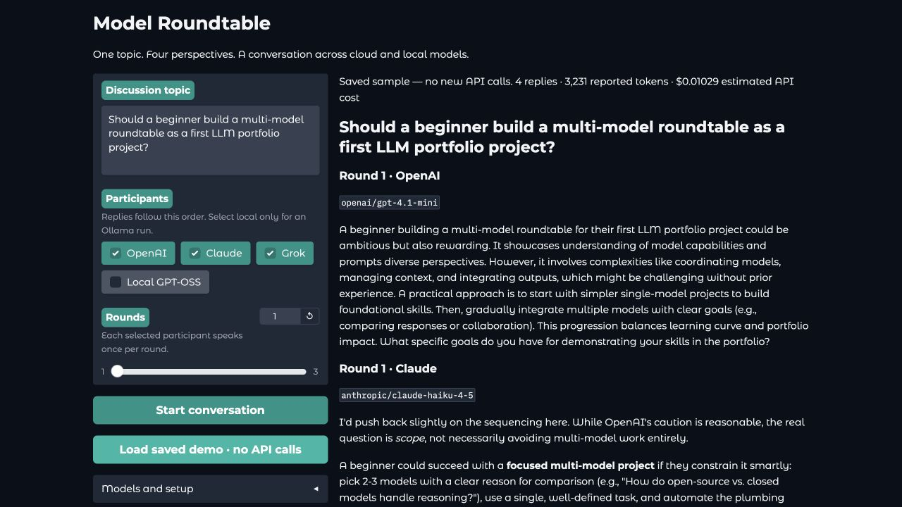

# Model Roundtable

A small Python app that lets several language models discuss one topic. OpenAI, Claude, Grok, and a local Ollama model take turns, reading the earlier replies before responding.

Built with **LiteLLM** for provider integration and **Gradio** for the browser interface. Load the saved demo to explore the project without API keys or model downloads.



## What it does

- Choose one to four participants and one to three rounds.
- Watch the conversation appear one completed reply at a time.
- Run local inference with `gpt-oss:20b` through Ollama.
- Track reported tokens and estimated API costs.
- Download the conversation as JSON, including model and usage metadata.
- Keep earlier replies available if a later provider fails.

## Quick start

Use **Python 3.11 or 3.12**. These dependency versions are pinned to the tested environment.

```bash
git clone https://github.com/anilvarma-kav/model-roundtable.git
cd model-roundtable
python3 -m venv .venv
source .venv/bin/activate
python -m pip install -r requirements.txt
python app.py
```

On Windows, use `python` instead of `python3` and activate with `.venv\Scripts\Activate.ps1` in PowerShell.

Open **http://127.0.0.1:7860**, then click **Load saved demo · no API calls**. The demo reads the included JSON file; it makes no model requests.

## Run a live conversation

Create your local configuration:

```bash
cp .env.example .env
```

On Windows, use `Copy-Item .env.example .env`. Add only the keys for the cloud providers you want to select:

```dotenv
OPENAI_API_KEY=your-openai-key
ANTHROPIC_API_KEY=your-anthropic-key
XAI_API_KEY=your-xai-key
```

`GROK_API_KEY` also works as an alias for `XAI_API_KEY`. API billing and access are managed by each provider. You do not need all three keys; deselect providers you have not configured. Restart the app after editing `.env`.

1. Enter a topic.
2. Select participants and set the number of rounds.
3. Click **Start conversation**.
4. Read the replies, check usage, and download the JSON file.

Four participants × two rounds means **eight model requests**. Each request includes recent conversation history, so later turns usually consume more input tokens.

### Use Ollama locally

Install [Ollama](https://ollama.com), start the Ollama app, and download the model:

```bash
ollama pull gpt-oss:20b
```

If Ollama is not already serving requests, run `ollama serve` in a separate terminal. Select **Local GPT-OSS** in the interface. This participant needs no cloud API key.

The 20B model needs substantial local memory and can be slow. To try a smaller model:

```bash
ollama pull llama3.2:1b
```

Then set `OLLAMA_MODEL=llama3.2:1b` in `.env` and restart. The participant label stays “Local GPT-OSS”, but every reply shows the actual configured model.

### Model configuration

| Participant | Default LiteLLM model | Override in `.env` |
| --- | --- | --- |
| OpenAI | `openai/gpt-4.1-mini` | `OPENAI_MODEL` |
| Claude | `anthropic/claude-haiku-4-5` | `ANTHROPIC_MODEL` |
| Grok | `xai/grok-4.6` | `GROK_MODEL` |
| Local GPT-OSS | `ollama_chat/gpt-oss:20b` | `OLLAMA_MODEL` |

Bare model names or matching `provider/model` names both work. Model availability depends on your account and may change. `OLLAMA_API_BASE` defaults to `http://localhost:11434`.

## How it works

```text
Topic + selected participants
          |
          v
    Round-robin loop
          |
          +--> LiteLLM --> selected model
          |                   |
          |            reply + usage
          |                   |
          +<-- shared transcript
                              |
                       Gradio + JSON
```

The participant order is OpenAI → Claude → Grok → local model, skipping unchecked entries. Calls run sequentially so each participant can react to the previous speaker. Participants have different prompts: framing the problem, examining tradeoffs, challenging ideas, and focusing on implementation.

The loop sends complete recent turns within a 12,000-character history budget. Each call has a 1,500-token output allowance and a 180-second timeout. There are no automatic retries or hidden fallback calls. Replies that hit the output limit are marked as potentially incomplete. The 140-word instruction is a prompt preference, not a guaranteed limit.

## Real sample conversation

The included [JSON transcript](examples/roundtable.json) is an actual four-provider run from the original notebook experiment. Its topic was:

> Should a beginner build a multi-model roundtable as a first LLM portfolio project?

The discussion raised useful disagreements: start simple, constrain the scope, explain the model choices, and avoid building a demo without a clear purpose. Read the [full sample and observations](examples/README.md).

That run reported **3,231 tokens** and **$0.01029 estimated cloud cost**. It used the older `ollama/` route; this app uses LiteLLM's recommended `ollama_chat/` route. The saved outputs are preserved as received, including imperfect suggestions and replies longer than requested.

## Project structure

```text
model-roundtable/
├── app.py                 # Gradio interface and download handling
├── roundtable.py          # Provider configuration and conversation loop
├── requirements.txt       # Three direct dependencies
├── .env.example           # Configuration template; no real keys
├── examples/
│   ├── README.md          # Sample transcript and observations
│   └── roundtable.json    # Real model replies and usage
└── tests/
    └── test_roundtable.py # Orchestration and failure-path tests
```

## Test

```bash
python -m unittest discover -s tests -v
```

Tests mock provider calls and require no API keys or Ollama server. They cover shared history, validation before paid requests, complete-turn context trimming, empty responses, truncated replies, unknown pricing, partial results, and exports.

## Design choices and limits

This is a learning project for practicing Python, API integration, prompt design, state management, and error handling. LiteLLM keeps the provider-specific code small; the loop is plain Python so it is easy to follow.

- A group discussion does not guarantee correct answers or meaningful consensus. This project has no factual evaluation or voting system.
- Roles are prompts. Changing the role or speaking order can change the outcome.
- Cost figures are estimates based on LiteLLM's pricing data. Unknown prices are shown as unavailable, not zero. Local inference has no provider API fee, but uses your hardware and electricity.
- A mixed cloud/local conversation sends the shared transcript, including local replies, to selected cloud providers. Select only the local participant for local model inference.
- `.env` is ignored by Git. Keys are read by the Python process and are not included in downloads. The app binds to localhost and does not create a public share link.
- JSON downloads use temporary files on your machine. Clear those files when no longer needed.

## Troubleshooting

| Symptom | What to check |
| --- | --- |
| Missing API key | Fill the matching variable in `.env`, restart, or deselect that provider. |
| Authentication or quota error | Check the provider's API key, billing, and rate limits. |
| Model request fails | Confirm the model name and account access; update the corresponding model variable. |
| Local model fails or times out | Run `ollama list`, check Ollama is running, or choose a smaller model. |
| No visible reply | A reasoning model may have used its output budget internally. Try a chat model or increase `max_tokens` in `roundtable.py`. |
| Port 7860 is occupied | Gradio prints the chosen local URL; use that address. |

References: [LiteLLM](https://docs.litellm.ai/), [Gradio](https://www.gradio.app/guides/quickstart), [Ollama integration](https://docs.litellm.ai/docs/providers/ollama).
